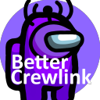

[![GPL-3.0 License][license-shield]][license-url] [![Appveyor Build][appveyor-shield]][appveyor-url] [![Donate][paypal-shield]](paypal-url)

<br />
<p align="center">
  <a href="https://github.com/OhMyGuus/BetterCrewLink">
    
  </a>
  <h3 align="center"> <a href="https://github.com/OhMyGuus/BetterCrewLink">BetterCrewLink</a> a <a href="https://github.com/ottomated/CrewLink">CrewLink</a> fork with <a href="#extra-features-in-this-fork">extra features</a> & <a href="https://discord.gg/qDqTzvj4SH"> better support</h3></a>


  <p align="center">
    Free, open, Among Us proximity voice chat.
    <br />
    <a href="https://github.com/OhMyGuus/BetterCrewLink/issues">Report Bug</a>
    ·
  <a href="https://github.com/OhMyGuus/BetterCrewLink/pulls">Request Feature</a>
    ·
    <a href="#installation">Installation Instructions</a>
  </p>
  <p align="center">
    <b><a href="#donations">Donate to BetterCrewLink</a></b></br>
  (all donations will be used for the apple developer license and extra servers)</br>
  <br />
   <b><a href="https://paypal.me/ottomated">Donate to ottomated (offical CrewLink)</a></b>
  </p>
</p>
<hr />

<p>
  
## Notes

**BE AWARE THIS IS AN UNOFFICAL FORK OF CREWLINK**

**WARNING: This is a unofficial FAQ of BetterCrewLink but everything here was taken from GitHub and Discord and some that I discovered and put, I'm just a fan of the project.**

 - For problems with this fork, you can send a message on the Discord (ThaGuus#2140 - owner and developer of BetterCrewLink), using [GitHub Issues](https://github.com/OhMyGuus/BetterCrewLink/issues) or [joining Discord](https://discord.gg/qDqTzvj4SH) and we will do our best to resolve it, do not ask for help from the official CrewLink server, as this is a fork unofficial and they will not support you, just use these three methods above if you need any help.

 - To get the most of BetterCrewLink use the voice server: <a href="https://bettercrewl.ink">`https://bettercrewl.ink`</a>

</p>
<a href="https://discord.gg/qDqTzvj4SH">  </a>

<!-- TABLE OF CONTENTS -->
## Table of Contents

* [About the Project](#about-the-project)
* [Extra features/bug fixes in this fork](#extra-featuresbug-fixes-in-this-fork)
* [Installation](#installation)
* [Possible Questions - FAQ](#possible-questions---faq)
* [Change Logs](#change-logs)
* [Upcoming Features](#upcoming-features)
* [Create a Server](#create-a-server)
* [Development](#development)
  * [Prerequisites](#prerequisites)
  * [Setup](#setup)
* [Contributing](#contributing)
* [Donations](#donations)
* [Informations](#informations)
* [License](#license)

## About the Project

**CrewLink:** This project implements proximity voice chat in Among Us. Everyone in an Among Us lobby with this program running will be able to communicate over voice in-game, with no third-party programs required. Spatial audio ensures that you can only hear people close to you.

**BetterCrewLink:** A modified version of [CrewLink](https://github.com/ottomated/CrewLink) with improved things such as: optimizations for CPU (solves robotic voices), more settings (listening to people on the cameras), support for mobile BETA ([via app](https://play.google.com/store/apps/details?id=io.bettercrewlink.app)) and more.

## Extra features/bug fixes in this fork
```
- OBS browsersource overlay.
- Hear people in vision only.
- Walls block audio. 
- Volume sliders.
- It doesn't break when someone leaves/disconnects.
- It works on any network even with upnp disabled (Strict NAT)
- More fun settings like hearing through cameras.
- You can actually disable the overlay.
- 32bit support, windows 7 support.
- You can change the volume of alive players after u died.
- You can set BetterCrewLink to topmost.
- Settings actually sync between players and not half.
- CPU usage is lower than original CrewLink.
- You can actually press the mute key/deafen key while clicked on BetterCrewLink.
- Your mouse doesn't start to lagg because of the buggy input hook.
- Changing the speaker setting does actually something unlike original CrewLink where it is always using the default output.
- Compatible with CrewLink 2.0 
- Microphone echo cancellation.
- Microphone noise suppression.
- More overlay positions and you can set the overlay to the top/bottom and you can set it so it shows everyone even when they aren't talking.
- You can set the lobby up so only death people can talk (normal lobbies but then with death talk)
- Support for new version of Among Us (v2021.3.5)
- Support for custom colors (mods that add more colors)
- Support for mobile (BETA)
```
If you want to suggest something that could be added, talk to the owner and developer of BetterCrewLink via Discord: ThaGuus#2140


## Installation

## PC:

## Windows:

[Click here](https://github.com/OhMyGuus/BetterCrewLink/releases/latest) and go to the Downloads section and click on "Download from github" or "Download from mirror" (you can download either one, they will download the same program), open the program, join or create a room on Among Us and that's it.

or 

Use a web version: <a href="https://web.bettercrewl.ink">`https://web.bettercrewl.ink`</a> (remember that you will need someone in the room to have the BetterCrewLink application installed on the PC, it must be on the PC with the "Mobile Host" option enabled (the web version only works with official CrewLink Server: <a href="https://crewl.ink">`https://crewl.ink`</a>, it cannot be any other than the official server one <a href="https://crewl.ink">`https://crewl.ink`</a>, the official BetterCrewLink Server: <a href="https://bettercrewl.ink">`https://bettercrewl.ink`</a> and the others that use the project [OhMyGuus/BetterCrewLink-server](https://github.com/OhMyGuus/BetterCrewLink-server)).

In my opinion I recommend you use the web version if your PC is a very bad PC, because from what I had in my experience with BetterCrewLink people who download BetterCrewLink and use it with a very weak PC (practically on a very weak laptop) no had a good experience, he suffered from robotic voices constantly, so in my opinion if you have a very weak PC, ask your friend who has a medium or good PC to download and use BetterCrewLink, activate the "Mobile Host" option that is in the settings and then just enter the site, accept microphone permission, put the same name in Among Us and the code too and click on "Connect", enter the room and you're done.

## Linux/macOS/Chromebook:

No, the Linux version is being developed and you can see its development by [clicking here](https://github.com/OhMyGuus/BetterCrewLink/pull/29) (and also when I release the version for Linux I will teach here how to use), but the others have not confirmed anything support, but that doesn’t mean you can’t use BetterCrewLink, there’s still a solution which is the web version (requires a PC player using the BetterCrewLink app) for more information on this [click here](#windows) and read the last paragraph of the "Windows" category.

If you’re on a Chromebook, you can use the Android app by [clicking here](#android).

## **Android:**

You will need a person using BetterCrewLink on the PC and with the "Mobile Host" option enabled (to activate and just go in the settings and go down until you find the Mobile Host option) and the person on the cell phone will need to have the application from the [Play Store](https://play.google.com/store/apps/details?id=io.bettercrewlink.app) and when you open the application, allow the permissions it will ask for, put the same name and code that is in Among Us, click on "Connect", enter the room and that's it (remember that the mobile app only supports `https://` servers that don't have `https://` won't work for the mobile version).

## **iOS:**

For now there is no support for iOS, but you can bring support for iOS, but the project needs $100 to pay Apple's license to put the app on the App Store, so if you have money and feel like helping [donate via Patreon](https://patreon.com/OhMyGuus), [donate via PayPal](https://www.paypal.com/donate/?hosted_button_id=KS43BDTGN76JQ) or [donate via Buy Me a Coffee](https://www.buymeacoffee.com/OhMyGuus).

or

Use a Web version (until they get $100 to put the app on the App Store): <a href="https://web.bettercrewl.ink">`https://web.bettercrewl.ink`</a> and when you open the website, allow the permission of the microphone it will ask for, put the same name and code that is in Among Us, click on "Connect", enter the room and that's it (the web version only works with official CrewLink server: <a href="https://crewl.ink">`https://crewl.ink`</a>, it cannot be any other than the official server one <a href="https://crewl.ink">`https://crewl.ink`</a>, the official BetterCrewLink server: <a href="https://bettercrewl.ink">`https://bettercrewl.ink`</a> and the others that use the project [OhMyGuus/BetterCrewLink-server](https://github.com/OhMyGuus/BetterCrewLink-server)).


## Possible Questions - FAQ

* Q: How it works?
  * A: BetterCrewLink looks at your Among Us memory RAM to get data from your location and with that sends it to the server and the server sends the voice to others who are close to you.

* Q: Is BetterCrewLink a virus?
  * A: No, many people use BetterCrewLink as YouTubers and Streamers and as a fan of the project I say that it is totally safe, Windows ends up kind of "blocking" the file because its script is used a lot in viruses to destroy your PC, if you still aren't convinced, [click here](https://www.virustotal.com/) and place the BetterCrewLink file, so it will do a scan of the file with "all" antivirus (some antivirus will say it is a trojan or something, but as I said this script is used a lot in common with viruses)

* Q: Does BetterCrewLink work with Steam, Microsoft Store, Epic Game and Cracked versions?
  * A: Yes, but if you use a cracked version, please buy the game and help the developers of Among Us, it costs only $5 and if you use a cracked version know that this is illegal and has a high chance of you being arrested using cracked versions of Among Us.

* Q: Can I play with my CrewLink friend using the BetterCrewLink?
  * A: Yes, as long as you are on the same server, but if your friend activates a personalized Lobby Settings option that you don’t have in CrewLink, the function will only work for those with BetterCrewLink and for CrewLink users the option will not work, that is my recommendation and that you speak for your friends or people in the room to download BetterCrewLink.

* Q: Can I play on a BetterCrewLink server using CrewLink or can i play on a CrewLink server using BetterCrewLink?
  * A: Both, the servers works for BetterCrewLink users and with CrewLink users, but it is always recommended that users using the BetterCrewLink server use BetterCrewLink for greater compatibility.

* Q: How to resolve this error: 
ERROR

Couldn't connect to Among Us.

Please re-open CrewLink as Administrator.

Need help? Get support

  * A: Right click on the BetterCrewLink icon and then wait a while and a screen will appear with two options "Yes" and "No" you click Yes and that's it, now BetterCrewLink will work normally (whenever you open BetterCrewLink, you will have to do this step, otherwise it will be giving the error again)

or

to facilitate this, right-click on BetterCrewLink, click on "Properties", click on "Compatibility", then on "Run this program as administrator" or something like that, check the option and then just click on "Apply" and "Ok" and ready, whenever you open BetterCrewLink it will ask for administrator permission (much easier than every time having to press the right button and then "Run as administrator") then just click "Yes" every time you open BetterCrewLink, but if the problem continues, try to follow these steps: 

`A) If you get the administrator message without the game running -> The game hasn't closed correctly go to your desktop do ALT+F4 and click shutdown and restart your pc that way.`

`B) You get the administrator message after you launched the game -> You started Steam by accident as admin close Steam fully using task manager and start it again and make sure you don't start it as admin.`

Watch this video for a better understanding, (but instead of doing it on CrewLink, you’ll do it on BetterCrewLink): https://youtu.be/CoUtc5WyALE

* Q: Why can't I hear anyone or some people?
  * A: Check if everyone is using the same server, try pressing Ctrl + R or click on the button next to the settings, make sure that the selected Audio Input is the same as the one you use in the BetterCrewLink settings in the "Audio" category, but if none of these things work, try to activate NAT Fix in the settings that is in the "Advanced" category or open your NAT in your config router (remember that automatically when you activate the NAT Fix option, if you do not live in Europe you will have a 3 second delay, this applies both to the PC application and to the mobile application).

* Q: Why can't everyone hear me or can't hear one person or more?
  * A: Check if everyone is using the same server, try pressing Ctrl + R or click on the button next to the settings, try to enable NAT Fix (remember that automatically when you activate the NAT Fix option, if you do not live in Europe you will have a 3 second delay, this applies both to the PC application and to the mobile application), make sure that the selected Microphone is the same as the one you use in the BetterCrewLink settings in the "Audio" category, but if none of these things work, verify if "Microphone Sensibility" if it is activated and is at maximum or almost at maximum, if it is, decrease the "Microphone Sensibility" or uncheck the option and it will probably work again.

* Q: Why are robotic voices still going on? 
  * A: Most of the time BetterCrewLink solves the problem of robotic voices that happen with the normal CrewLink, if not, disable some settings in the BETA/DEBUG category (mainly the VAD option, it consumes a lot of CPU in BetterCrewLink), if that also doesn't work, close some programs on your PC that consume a lot of CPU, but if that doesn't work either, go to a PC parts store and buy a better CPU or use a version web (requires a PC player using the BetterCrewLink app) for more information on this [click here](#installation) and look at the category "PC".

* Q: Does BetterCrewLink update whenever there is an update?
  * A: Yes, they have an updater that whenever you open the program, it will check for any updates, if there is one it will automatically start updating to the latest version.

* Q: How can I put the BetterCrewLink overlay on my OBS Studio/StreamLabs/other screen recorder programs?
 * A: 
*(if the image is small, click on it)*

**WARNING: other screen recorder programs that does not have the "Browser" option, OBS Overlay will not work, because you need to put the link for OBS Overlay to work, I recommend that you use <a href="https://obsproject.com/download">OBS Studio</a> or <a href="https://streamlabs.com">Streamlabs</a>, they are the recorders most used by people and also they come with the "Browser" function.**

* Q: Can I use BetterCrewLink with my Among Us mods?
  * A: Yes, all mods are compatible with BetterCrewLink (up to 100 players, only one thing is that the more people in the room using BetterCrewLink the more the use of your CPU will increase and you will probably suffer from very strong robotic and locked voices) minus [Among Us: CE](https://gamebanana.com/wips/52892) (Community Edition) for now, because as it uses an old version of Among Us, it cannot recognize it.

* Q: Which "Voice Server" is recommended for me to use?
  * A: I recommend that you use: <a href="https://bettercrewl.ink">`https://bettercrewl.ink`</a> for better compatibility with BetterCrewLink.

* Q: Do you have a BetterCrewLink Discord so I can ask for help with something?
  * A: Yes and he and the [Official Discord of BetterCrewLink](https://discord.gg/qDqTzvj4SH), if you want to enter click on the image below:
  </p>
  <a href="https://discord.gg/qDqTzvj4SH">  </a>
  
## Change Logs

**Update 2.3.6**

**Changes & Updates**

Now the default voice server that will go to BetterCrewLink will be: <a href="https://bettercrewl.ink">`https://bettercrewl.ink`</a>

**Update 2.3.5**

**Changes & Updates**

* Implemented push to mute (hold the button to mute and release to speak) (thanks to: [@JKohlman](https://github.com/JKohlman)).
* Now the volume switchers are more beautiful ([@JKohlman](https://github.com/JKohlman)).
* Deafen & undeafen won't frick with the push to talk settings anymore.
* Added support for custom colors of the mods.
* Support for new version of Among Us (v2021.3.5).

## Upcoming Features

* ~~Obs overlay~~ (has already been placed on BetterCrewLink)

* Better mobile support

* ~~Can hear through cams~~ (has already been placed on BetterCrewLink)

* ~~No talking through walls~~ (has already been placed on BetterCrewLink)

* Community servers list in app

* iOS support ($100 developer license) (the $100 target for the iOS app has been hit, now we have to wait for [OhMyGuus](https://github.com/OhMyGuus) - owner and developer of BetterCrewLink to start creating an iOS version)

## Create a Server

See [OhMyGuus/BetterCrewLink-server](https://github.com/OhMyGuus/BetterCrewLink-server) to learn how to create a BetterCrewLink server (creating a server using BetterCrewLink code instead of CrewLink will bring a lot more support to BetterCrewLink and the server will also work with normal people using CrewLink)

## Development

You only need to follow the below instructions if you are trying to modify this software. Otherwise, please download the latest version from the [github releases](https://github.com/OhMyGuus/BetterCrewLink/releases).

Server code is located at [OhMyGuus/BetterCrewLink-server](https://github.com/OhMyGuus/BetterCrewLink-server). Please use a local server for development purposes.

### Prerequisites

This is an example of how to list things you need to use the software and how to install them.
* [Python](https://www.python.org/downloads)
* [node.js](https://nodejs.org/en/download)
* yarn
```sh
npm install yarn -g
```

### Setup

1. Clone the repo
```sh
git clone https://github.com/OhMyGuus/BetterCrewLink.git
cd BetterCrewLink
```
2. Install NPM packages
```sh
yarn install
```
3. Run the project
```JS
yarn dev
```

<!-- CONTRIBUTING -->
## Contributing

Any contributions you make are greatly appreciated.

1. [Fork this Project](https://github.com/OhMyGuus/BetterCrewLink/fork)
2. Create your Feature Branch (`git checkout -b feature/AmazingFeature`)
3. Commit your Changes (`git commit -m 'Add some AmazingFeature'`)
4. Push to the Branch (`git push origin feature/AmazingFeature`)
5. Open a Pull Request

## Donations

If you like the project, you have money and want to help them continue the project, donate to them, [donate via Patreon](https://www.patreon.com/OhMyGuus), [donate via PayPal](https://www.paypal.com/donate/?hosted_button_id=KS43BDTGN76JQ) or [donate via Buy Me a Coffee](https://www.buymeacoffee.com/OhMyGuus).

## Informations

The proximity voice chat was originally done by [CrewLink](https://github.com/ottomated/CrewLink) - [ottomatted](https://github.com/ottomated) but was modified by [BetterCrewLink](https://github.com/OhMyGuus/BetterCrewLink) - [OhMyGuus](https://github.com/OhMyGuus) with improvements, features and others, this FAQ was made by a user or a fan of the project, the FAQ is not official and any questions you have between on the [BetterCrewLink Discord](https://discord.gg/qDqTzvj4SH) to ask for support, this FAQ was made to help people searching on GitHub how to use a proximity voice chat in Among Us (since the BetterCrewLink fork does not appear) and I had no intention of plagiarizing anything from BetterCrewLink and also all the information was taken from there and all links are official from BetterCrewLink/CrewLink.

</p>
<a href="https://discord.gg/qDqTzvj4SH">  </a>

## License

Distributed under the GNU General Public License v3.0. See <a href="https://github.com/OhMyGuus/BetterCrewLink/blob/nightly/LICENSE">`LICENSE`</a> for more information.

[license-shield]: https://img.shields.io/github/license/OhMyGuus/BetterCrewLink.svg?style=flat-square
[license-url]: https://github.com/OhMyGuus/BetterCrewLink/blob/nightly/LICENSE
[appveyor-shield]: https://img.shields.io/appveyor/build/OhMyGuus/bettercrewlink
[appveyor-url]: https://ci.appveyor.com/project/OhMyGuus/bettercrewlink
[paypal-url]: https://www.paypal.com/donate?hosted_button_id=KS43BDTGN76JQ
[paypal-shield]: https://img.shields.io/badge/Donate-PayPal-green.svg
